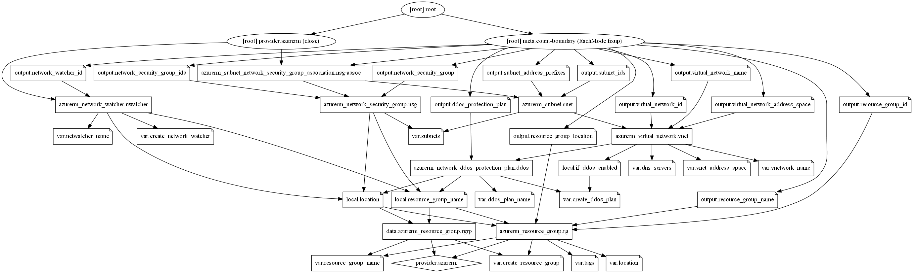

# Azure Virtual Network Terraform Module

Terraform Module to create Azure virtual network with optional NSG, Service delegation, service endpoints, AzureFirewallSubnet and GatewaySubnet creation.

Type of resources are supported:

* [Virtual Network](https://www.terraform.io/docs/providers/azurerm/r/virtual_network.html)
* [Subnets](https://www.terraform.io/docs/providers/azurerm/r/subnet.html)
* [Subnet Service Delegation](https://www.terraform.io/docs/providers/azurerm/r/subnet.html#delegation)
* [Virtual Network service endpoints](https://www.terraform.io/docs/providers/azurerm/r/subnet.html#service_endpoints)
* [Private Link service/Endpoint network policies on Subnet](https://www.terraform.io/docs/providers/azurerm/r/subnet.html#enforce_private_link_endpoint_network_policies)
* [AzureNetwork DDoS Protection Plan](https://www.terraform.io/docs/providers/azurerm/r/network_ddos_protection_plan.html)
* [Network Watcher](https://www.terraform.io/docs/providers/azurerm/r/network_watcher.html)
* [Network Security Groups](https://www.terraform.io/docs/providers/azurerm/r/network_security_group.html)

## Module Usage

```hcl
# Azurerm provider configuration
provider "azurerm" {
  features {}
}

module "vnet" {
  source  = "kumarvna/vnet/azurerm"
  version = "2.2.0"

  # By default, this module will not create a resource group, proivde the name here
  # to use an existing resource group, specify the existing resource group name,
  # and set the argument to `create_resource_group = true`. Location will be same as existing RG.
  resource_group_name            = "rg-shared-westeurope-02"
  vnetwork_name                  = "vnet-shared-hub-westeurope-002"
  location                       = "westeurope"
  vnet_address_space             = ["10.1.0.0/16"]
  firewall_subnet_address_prefix = ["10.1.0.0/26"]
  gateway_subnet_address_prefix  = ["10.1.1.0/27"]
  create_network_watcher         = false

  # Adding Standard DDoS Plan, and custom DNS servers (Optional)
  create_ddos_plan = false

  # Multiple Subnets, Service delegation, Service Endpoints, Network security groups
  # These are default subnets with required configuration, check README.md for more details
  # NSG association to be added automatically for all subnets listed here.
  # First two address ranges from VNet Address space reserved for Gateway And Firewall Subnets.
  # ex.: For 10.1.0.0/16 address space, usable address range start from 10.1.2.0/24 for all subnets.
  # subnet name will be set as per Azure naming convention by defaut. expected value here is: <App or project name>
  subnets = {
    mgnt_subnet = {
      subnet_name           = "snet-management"
      subnet_address_prefix = ["10.1.2.0/24"]
      delegation = {
        name = "testdelegation"
        service_delegation = {
          name    = "Microsoft.ContainerInstance/containerGroups"
          actions = ["Microsoft.Network/virtualNetworks/subnets/join/action", "Microsoft.Network/virtualNetworks/subnets/prepareNetworkPolicies/action"]
        }
      }

      nsg_inbound_rules = [
        # [name, priority, direction, access, protocol, destination_port_range, source_address_prefix, destination_address_prefix]
        # To use defaults, use "" without adding any values.
        ["weballow", "100", "Inbound", "Allow", "Tcp", "80", "*", "0.0.0.0/0"],
        ["weballow1", "101", "Inbound", "Allow", "", "443", "*", ""],
        ["weballow2", "102", "Inbound", "Allow", "Tcp", "8080-8090", "*", ""],
      ]

      nsg_outbound_rules = [
        # [name, priority, direction, access, protocol, destination_port_range, source_address_prefix, destination_address_prefix]
        # To use defaults, use "" without adding any values.
        ["ntp_out", "103", "Outbound", "Allow", "Udp", "123", "", "0.0.0.0/0"],
      ]
    }

    dmz_subnet = {
      subnet_name           = "snet-appgateway"
      subnet_address_prefix = ["10.1.3.0/24"]
      service_endpoints     = ["Microsoft.Storage"]

      nsg_inbound_rules = [
        # [name, priority, direction, access, protocol, destination_port_range, source_address_prefix, destination_address_prefix]
        # To use defaults, use "" without adding any values.
        ["weballow", "200", "Inbound", "Allow", "Tcp", "80", "*", ""],
        ["weballow1", "201", "Inbound", "Allow", "Tcp", "443", "AzureLoadBalancer", ""],
        ["weballow2", "202", "Inbound", "Allow", "Tcp", "9090", "VirtualNetwork", ""],
      ]

      nsg_outbound_rules = [
        # [name, priority, direction, access, protocol, destination_port_range, source_address_prefix, destination_address_prefix]
        # To use defaults, use "" without adding any values.
      ]
    }
  }

  # Adding TAG's to your Azure resources (Required)
  tags = {
    ProjectName  = "demo-internal"
    Env          = "dev"
    Owner        = "user@example.com"
    BusinessUnit = "CORP"
    ServiceClass = "Gold"
  }
}
```

## Create resource group

By default, this module will create a resource group and the name of the resource group to be given in an argument `resource_group_name`. If you want to use an existing resource group, specify the existing resource group name, and set the argument to `create_resource_group = false`.

> *If you are using an existing resource group, then this module uses the same resource group location to create all resources in this module.*

## Azure Network DDoS Protection Plan

By default, this module will not create a DDoS Protection Plan. You can enable/disable it by appending an argument `create_ddos_plan`. If you want to enable a DDoS protection plan using this module, set the argument `create_ddos_plan = true`.

## Custom DNS servers

This is an optional feature and only applicable if you are using your own DNS servers superseding default DNS services provided by Azure.Set the argument `dns_servers = ["4.4.4.4"]` to enable this option. For multiple DNS servers, set the argument `dns_servers = ["4.4.4.4", "8.8.8.8"]`

## Subnets

This module handles the following types of subnet creation:

* __Subnets__ - add, change, or delete of subnet supported. The subnet name and address range must be unique within the address space for the virtual network. A subnet may optionally have one or more service endpoints enabled for it. To enable a service endpoint for a service, select the service or services that you want to enable service endpoints for from the Services list. A subnet may optionally have one or more delegations enabled for it. Subnet delegation gives explicit permissions to the service to create service-specific resources in the subnet using a unique identifier during service deployment. To delegate for a service, select the service you want to delegate to from the Services list.

* __GatewaySubnet__ - Subnet to provision VPN Gateway or Express route Gateway.  This can be created by setting up `gateway_subnet_address_prefix` argument with a valid address prefix. This subnet must have a name "AzureFirewallSubnet" and the mask of at least /27

* __AzureFirewallSubnet__ - If added the Firewall module, this subnet is to deploys an Azure Firewall that will monitor all incoming and outgoing traffic.  This can be created by setting up `firewall_subnet_address_prefix` argument with a valid address prefix. This subnet must have a name "AzureFirewallSubnet" and the mask of at least /26

It is also possible to add other routes to the associated route tables outside of this module. This module also creates network security groups for all subnets except Gateway and firewall subnets.

## Virtual Network service endpoints

Service Endpoints allows connecting certain platform services into virtual networks.  With this option, Azure virtual machines can interact with Azure SQL and Azure Storage accounts, as if they’re part of the same virtual network, rather than Azure virtual machines accessing them over the public endpoint.

This module supports enabling the service endpoint of your choosing under the virtual network and with the specified subnet. The list of Service endpoints to associate with the subnet values include: `Microsoft.AzureActiveDirectory`, `Microsoft.AzureCosmosDB`, `Microsoft.ContainerRegistry`, `Microsoft.EventHub`, `Microsoft.KeyVault`, `Microsoft.ServiceBus`, `Microsoft.Sql`, `Microsoft.Storage` and `Microsoft.Web`.

```hcl
module "vnet" {
  source  = "kumarvna/vnet/azurerm"
  version = "2.2.0"

  # .... omitted

  # Multiple Subnets, Service delegation, Service Endpoints
  subnets = {
    mgnt_subnet = {
      subnet_name           = "management"
      subnet_address_prefix = "10.1.2.0/24"

      service_endpoints     = ["Microsoft.Storage"]  
    }
  }

# ....omitted

}
```

## Subnet Service Delegation

Subnet delegation enables you to designate a specific subnet for an Azure PaaS service of your choice that needs to be injected into your virtual network. The Subnet delegation provides full control to manage the integration of Azure services into virtual networks.

This module supports enabling the service delegation of your choosing under the virtual network and with the specified subnet.  For more information, check the [terraform resource documentation](https://www.terraform.io/docs/providers/azurerm/r/subnet.html#service_delegation).

```hcl
module "vnet" {
  source  = "kumarvna/vnet/azurerm"
  version = "2.2.0"

  # .... omitted

  # Multiple Subnets, Service delegation, Service Endpoints
  subnets = {
    mgnt_subnet = {
      subnet_name           = "management"
      subnet_address_prefix = "10.1.2.0/24"

      delegation = {
        name = "demodelegationcg"
        service_delegation = {
          name    = "Microsoft.ContainerInstance/containerGroups"
          actions = ["Microsoft.Network/virtualNetworks/subnets/join/action", "Microsoft.Network/virtualNetworks/subnets/prepareNetworkPolicies/action"]
        }
      }
    }
  }

# ....omitted

}
```

## `enforce_private_link_endpoint_network_policies` - Private Link Endpoint on the subnet

Network policies, like network security groups (NSG), are not supported for Private Link Endpoints. In order to deploy a Private Link Endpoint on a given subnet, you must set the `enforce_private_link_endpoint_network_policies` attribute to `true`. This setting is only applicable for the Private Link Endpoint, for all other resources in the subnet access is controlled based via the Network Security Group which can be configured using the `azurerm_subnet_network_security_group_association` resource.

This module Enable or Disable network policies for the private link endpoint on the subnet. The default value is `false`. If you are enabling the Private Link Endpoints on the subnet you shouldn't use Private Link Services as it's conflicts.

```hcl
module "vnet" {
  source  = "kumarvna/vnet/azurerm"
  version = "2.2.0"

  # .... omitted

  # Multiple Subnets, Service delegation, Service Endpoints
  subnets = {
    mgnt_subnet = {
      subnet_name           = "management"
      subnet_address_prefix = "10.1.2.0/24"
      enforce_private_link_endpoint_network_policies = true

        }
      }
    }
  }

# ....omitted

}
```

## `enforce_private_link_service_network_policies` - private link service on the subnet

In order to deploy a Private Link Service on a given subnet, you must set the `enforce_private_link_service_network_policies` attribute to `true`. This setting is only applicable for the Private Link Service, for all other resources in the subnet access is controlled based on the Network Security Group which can be configured using the `azurerm_subnet_network_security_group_association` resource.

This module Enable or Disable network policies for the private link service on the subnet. The default value is `false`. If you are enabling the Private Link service on the subnet then, you shouldn't use Private Link endpoints as it's conflicts.

```hcl
module "vnet" {
  source  = "kumarvna/vnet/azurerm"
  version = "2.2.0"

  # .... omitted

  # Multiple Subnets, Service delegation, Service Endpoints
  subnets = {
    mgnt_subnet = {
      subnet_name           = "management"
      subnet_address_prefix = "10.1.2.0/24"
      enforce_private_link_service_network_policies = true

        }
      }
    }
  }

# ....omitted

}
```

## Network Watcher

This module handle the provision of Network Watcher resource by defining `create_network_watcher` variable. It will enable network watcher, flow logs and traffic analytics for all the subnets in the Virtual Network. Since Azure uses a specific naming standard on network watchers, It will create a resource group `NetworkWatcherRG` and adds the location specific resource.

## Network Security Groups

By default, the network security groups connected to Management and ApplicationGateway will only allow necessary traffic and block everything else (deny-all rule). Use `nsg_inbound_rules` and `nsg_outbound_rules` in this Terraform module to create a Network Security Group (NSG) for each subnet and allow it to add additional rules for inbound flows.

In the Source and Destination columns, `VirtualNetwork`, `AzureLoadBalancer`, and `Internet` are service tags, rather than IP addresses. In the protocol column, Any encompasses `TCP`, `UDP`, and `ICMP`. When creating a rule, you can specify `TCP`, `UDP`, `ICMP` or `*`. `0.0.0.0/0` in the Source and Destination columns represents all addresses.

*You cannot remove the default rules, but you can override them by creating rules with higher priorities.*

```hcl
module "vnet" {
  source  = "kumarvna/vnet/azurerm"
  version = "2.2.0"

  # .... omitted

  # Multiple Subnets, Service delegation, Service Endpoints
  subnets = {
    mgnt_subnet = {
      subnet_name           = "management"
      subnet_address_prefix = ["10.1.2.0/24"]

     nsg_inbound_rules = [
        # [name, priority, direction, access, protocol, destination_port_range, source_address_prefix, destination_address_prefix]
        # To use defaults, use "" without adding any values.
        ["weballow", "100", "Inbound", "Allow", "Tcp", "80", "*", "", "http_80"],
        ["weballow1", "101", "Inbound", "Allow", "Tcp", "443", "AzureLoadBalancer", "", "https_443"],
        ["weballow2", "102", "Inbound", "Allow", "Tcp", "9090", "VirtualNetwork", "", "http_9090"],
      ]

      nsg_outbound_rules = [
        # [name, priority, direction, access, protocol, destination_port_range, source_address_prefix, destination_address_prefix]
        # To use defaults, use "" without adding any values.
        ["ntp_out", "103", "Outbound", "Allow", "Udp", "123", "", "0.0.0.0/0", ""],
      ]
    }
  }
}
```

## Recommended naming and tagging conventions

Well-defined naming and metadata tagging conventions help to quickly locate and manage resources. These conventions also help associate cloud usage costs with business teams via chargeback and show back accounting mechanisms.

> ### Resource naming

An effective naming convention assembles resource names by using important resource information as parts of a resource's name. For example, using these [recommended naming conventions](https://docs.microsoft.com/en-us/azure/cloud-adoption-framework/ready/azure-best-practices/naming-and-tagging#example-names), a public IP resource for a production SharePoint workload is named like this: `pip-sharepoint-prod-westus-001`.

> ### Metadata tags

When applying metadata tags to the cloud resources, you can include information about those assets that couldn't be included in the resource name. You can use that information to perform more sophisticated filtering and reporting on resources. This information can be used by IT or business teams to find resources or generate reports about resource usage and billing.

The following list provides the recommended common tags that capture important context and information about resources. Use this list as a starting point to establish your tagging conventions.

Tag Name|Description|Key|Example Value|Required?
--------|-----------|---|-------------|---------|
Project Name|Name of the Project for the infra is created. This is mandatory to create a resource names.|ProjectName|{Project name}|Yes
Application Name|Name of the application, service, or workload the resource is associated with.|ApplicationName|{app name}|Yes
Approver|Name Person responsible for approving costs related to this resource.|Approver|{email}|Yes
Business Unit|Top-level division of your company that owns the subscription or workload the resource belongs to. In smaller organizations, this may represent a single corporate or shared top-level organizational element.|BusinessUnit|FINANCE, MARKETING,{Product Name},CORP,SHARED|Yes
Cost Center|Accounting cost center associated with this resource.|CostCenter|{number}|Yes
Disaster Recovery|Business criticality of this application, workload, or service.|DR|Mission Critical, Critical, Essential|Yes
Environment|Deployment environment of this application, workload, or service.|Env|Prod, Dev, QA, Stage, Test|Yes
Owner Name|Owner of the application, workload, or service.|Owner|{email}|Yes
Requester Name|User that requested the creation of this application.|Requestor| {email}|Yes
Service Class|Service Level Agreement level of this application, workload, or service.|ServiceClass|Dev, Bronze, Silver, Gold|Yes
Start Date of the project|Date when this application, workload, or service was first deployed.|StartDate|{date}|No
End Date of the Project|Date when this application, workload, or service is planned to be retired.|EndDate|{date}|No

> This module allows you to manage the above metadata tags directly or as a variable using `variables.tf`. All Azure resources which support tagging can be tagged by specifying key-values in argument `tags`. Tag `ResourceName` is added automatically to all resources.

```hcl
module "vnet" {
  source  = "kumarvna/vnet/azurerm"
  version = "2.2.0"

  # ... omitted

  tags = {
    ProjectName  = "demo-internal"
    Env          = "dev"
    Owner        = "user@example.com"
    BusinessUnit = "CORP"
    ServiceClass = "Gold"
  }
}
```

## Requirements

Name | Version
-----|--------
terraform | >= 0.13
azurerm | >= 2.59.0

## Providers

| Name | Version |
|------|---------|
azurerm | >= 2.59.0

## Inputs

Name | Description | Type | Default
---- | ----------- | ---- | -------
`create_resource_group` | Whether to create resource group and use it for all networking resources | string | `"false"`
`resource_group_name` | The name of the resource group in which resources are created | string | `""`
`location`|The location of the resource group in which resources are created| string | `""`
`vnetwork_name`|The name of the virtual network| string | `""`
`vnet_address_space`|Virtual Network address space to be used |list|`[]`
`dns_servers` | List of DNS servers to use for virtual network | list |`[]`
`subnets`|For each subnet, create an object that contain fields|object|`{}`
`subnet_name`|A name of subnets inside virtual network| object |`{}`
`subnet_address_prefix`|A list of subnets address prefixes inside virtual network| list |`{}`
`gateway_subnet_address_prefix`|The address prefix to use for the gateway subnet|list|`null`
`firewall_subnet_address_prefix`|The address prefix to use for the Firewall subnet|list|`[]`
`delegation`|defines a subnet delegation feature. takes an object as described in the following example|object|`{}`
`service_endpoints`|service endpoints for the virtual subnet|object|`{}`
`nsg_inbound_rule`|network security groups settings - a NSG is always created for each subnet|object|`{}`
`nsg_outbound_rule`|network security groups settings - a NSG is always created for each subnet|object|`{}`
`create_ddos_plan` | Controls if DDoS protection plan should be created | string | `"false"`
`ddos_plan_name`|Name of Azure Network DDoS protection plan| string | `""`
`create_network_watcher`|Controls if Network Watcher resources should be created for the Azure subscription |string|`"true"`
`netwatcher_name`|The name of the Network Watcher| string |`""`
`Tags`|A map of tags to add to all resources|map|`{}`

## Outputs

Name | Description
---- | -----------
`resource_group_name` | The name of the resource group in which resources are created
`resource_group_id` | The id of the resource group in which resources are created
`resource_group_location`| The location of the resource group in which resources are created
`virtual_network_name` | The name of the virtual network.
`virtual_network_id` |The virtual NetworkConfiguration ID.
`virtual_network_address_space` | List of address spaces that are used the virtual network.
`subnet_ids` | List of IDs of subnets
`subnet_address_prefixes` | List of address prefix for  subnets
`network_security_group_ids`|List of Network security groups and ids
`network_security_group`|Network security group details - Useful for splat expression.
`ddos_protection_plan` | Azure Network DDoS protection plan
`network_watcher_id` | ID of Network Watcher

## Resource Graph



## Authors

Originally created by [Kumaraswamy Vithanala](mailto:kumarvna@gmail.com)

## Other resources

* [Virtual network documentation (Azure Documentation)](https://docs.microsoft.com/en-us/azure/virtual-network/)
* [Terraform AzureRM Provider Documentation](https://www.terraform.io/docs/providers/azurerm/index.html)
